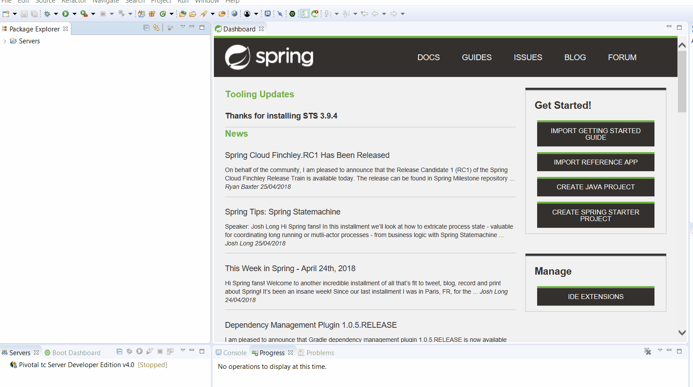
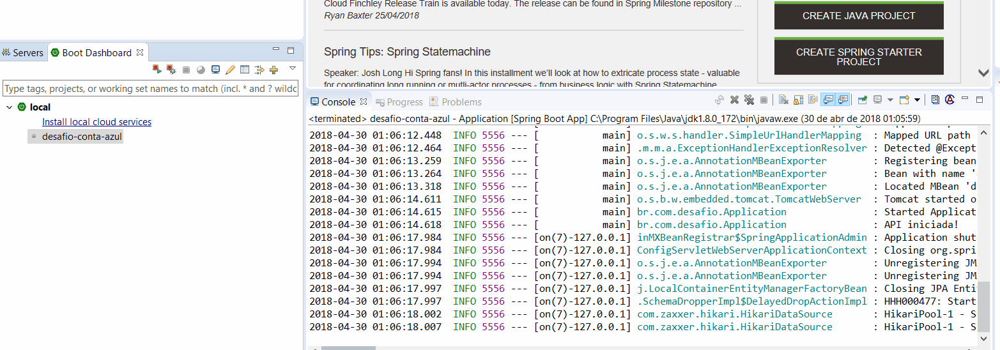
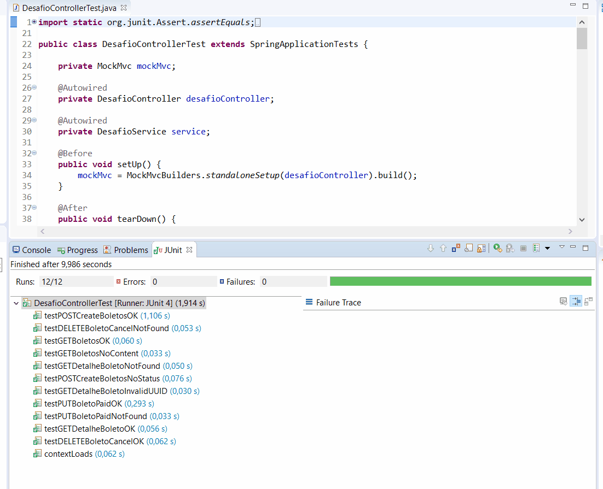
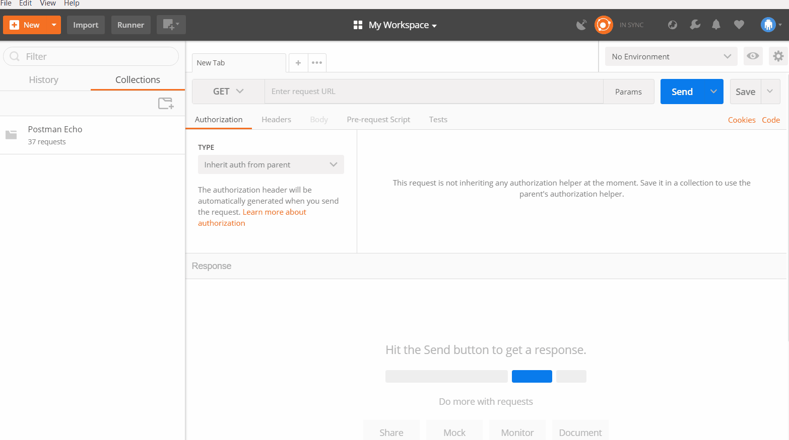
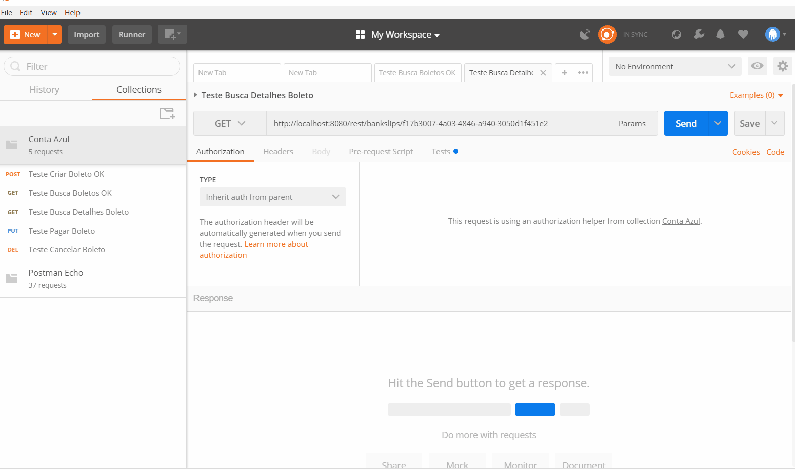

# Desafio #
O objetivo do desafio é construir uma API REST para geração de boletos que será
consumido por um módulo de um sistema de gestão financeira de microempresas.
No final do desafio vamos ter os seguintes endpoints para:
- Criar boleto
- Listar boletos
- Ver detalhes
- Pagar um boleto
- Cancelar um boleto

* Algumas descrições estão em .gif para visualizar melhor a forma de utilização.

## Ferramentas Utilizadas ##
 - Java 8
 - Banco de dados H2
 - Maven
 - Spring boot
 - Junit
 - Postman

## 1. Criando Projeto ##

#### 1.1 Clonando projeto #### 
 
Clone do projeto no github:

    git clone https://github.com/PedroJeunon/desafioContaAzul.git

#### 1.2 Importando Projeto STS ####  

#### 1.3 Executando projeto STS ####

#### 1.4 Rodando testes unitarios STS #### 

## 2. Testes automatizados Postman ##
O arquivo para realização dos testes estao dentro do projeto na pasta de 

#### 2.1 Importando Projeto Postman ####

#### 2.2 Executando Projeto Postman ####

## 3. Acompanhamento do Projeto ##

O projeto foi planejado e executado utilizando a ferramenta do trello. O  está disponivel para visualização.

